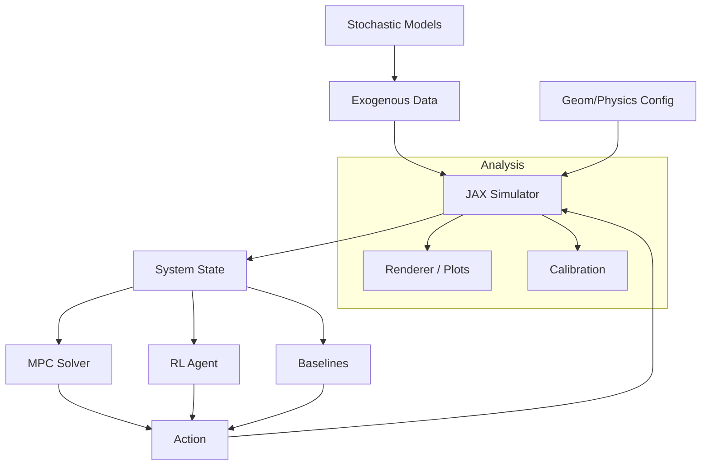

```mermaid
graph TD
    Data[Exogenous Data] --> Sim[JAX Simulator]
    Config[Geom/Physics Config] --> Sim
    Behavior[Stochastic Models] --> Data
    
    Sim --> State[System State]
    
    State --> MPC[MPC Solver]
    State --> RL[RL Agent]
    State --> Base[Baselines]
    
    MPC --> Action
    RL --> Action
    Base --> Action
    
    Action --> Sim
    
    subgraph Analysis
    Sim --> Renderer[Renderer / Plots]
    Sim --> SysID[Calibration]
    end
```